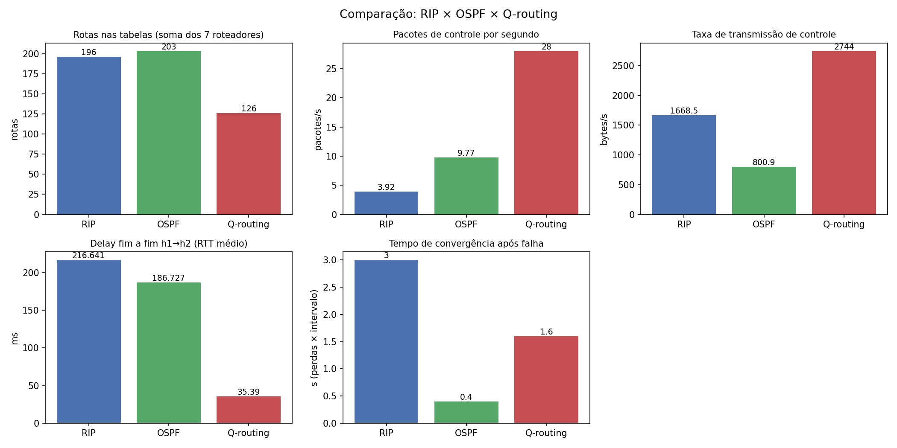

# Trabalho I – Roteamento IP

Redes de Computadores: Internetworking, Roteamento e Transmissao – UNISINOS (Prof. Cristiano Bonato Both)
Autores: Gustavo Ribeiro Schwert

## 1. Objetivo
Construir um ambiente experimental com 7 roteadores para configurar, observar e
comparar dois protocolos de roteamento (RIP e OSPF) e um algoritmo próprio, sobre a mesma topologia, avaliando métricas de desempenho e
comportamento diante de falhas de enlace.

## 2. Vídeo de demonstração
[link do vídeo]

## 3. Ambiente
| Atributo | Especificação |
|---|---|
| SO host | Microsoft Windows 11 Home 25H2 (x64) |
| Virtualização | Oracle VirtualBox 7.0 |
| SO guest | Ubuntu 26.04 LTS |
| Kernel | 7.0.0-30-generic (x86_64) |
| Plataforma de roteamento | BIRD 3.2.0 (pacote `bird3`, imagem Ubuntu 24.04) |
| Emulação da rede | Containerlab + Docker (1 container por roteador/host) |
| Algoritmo próprio e análise | Python 3 + matplotlib |

Toda a experimentação foi executada dentro da VM Ubuntu.

## 4. Topologia

### 4.1 Topologia física
7 roteadores (R1–R7) e 2 hosts (h1, h2):

```
        ┌─────── R2 ─────── R4 ───────┐
        │         │                   │
h1 ─── R1 ──────── R5 ───────────────R7 ─── h2
        │         │                   │
        └─────── R3 ─────── R6 ───────┘
```

Enlaces entre roteadores: R1–R2, R1–R3, R1–R5, R2–R4, R2–R5, R3–R5, R3–R6,
R4–R7, R5–R7 e R6–R7. Caminhos entre h1 e h2: R1–R5–R7,
R1–R2–R4–R7, R1–R3–R6–R7, R1–R2–R5–R7 e R1–R3–R5–R7.

### 4.2 Endereçamento e atraso dos enlaces
| Enlace | Rede | Lado A | Lado B | Atraso |
|---|---|---|---|---|
| R1–R2 | 10.0.12.0/30 | R1 eth1: .1 | R2 eth1: .2 | 5 ms |
| R1–R3 | 10.0.13.0/30 | R1 eth2: .1 | R3 eth1: .2 | 10 ms |
| R1–R5 | 10.0.15.0/30 | R1 eth3: .1 | R5 eth1: .2 | 30 ms |
| R2–R4 | 10.0.24.0/30 | R2 eth2: .1 | R4 eth1: .2 | 5 ms |
| R2–R5 | 10.0.25.0/30 | R2 eth3: .1 | R5 eth2: .2 | 10 ms |
| R3–R5 | 10.0.35.0/30 | R3 eth2: .1 | R5 eth3: .2 | 10 ms |
| R3–R6 | 10.0.36.0/30 | R3 eth3: .1 | R6 eth1: .2 | 10 ms |
| R4–R7 | 10.0.47.0/30 | R4 eth2: .1 | R7 eth1: .2 | 5 ms |
| R5–R7 | 10.0.57.0/30 | R5 eth4: .1 | R7 eth2: .2 | 30 ms |
| R6–R7 | 10.0.67.0/30 | R6 eth2: .1 | R7 eth3: .2 | 10 ms |
| LAN1 | 192.168.1.0/24 | R1 eth4: .1 | h1 eth1: .10 | – |
| LAN2 | 192.168.2.0/24 | R7 eth4: .1 | h2 eth1: .10 | – |

Os atrasos são emulados com `tc netem` (`algoritmo/aplicar_delays.sh`) e valem
para **os três cenários**. O caminho de menor atraso (R1–R2–R4–R7, 15 ms por
sentido) difere do caminho de menor número de saltos (R1–R5–R7, 60 ms).

### 4.3 Topologia lógica
- Router-ID e loopback de cada roteador: `10.255.0.N/32` (N = número do roteador).
- Enlaces ponto a ponto em redes /30; LANs em /24; encaminhamento IP habilitado
  em todos os roteadores.
- 19 redes no total: 10 enlaces, 7 loopbacks e 2 LANs.
- Interfaces das LANs são passivas (anunciadas, sem enviar mensagens de roteamento).

## 5. Estrutura do repositório
```
.
├── README.md
├── parar.sh                      # para o BIRD e remove rotas estáticas
├── topologia/                    # dockerfile e topologia.clab.yml
├── rip/                          # gerar_configs.py, iniciar.sh (gera configs/)
├── ospf/                         # gerar_configs.py, iniciar.sh (gera configs/)
├── algoritmo/                    # qrouting.py, aplicar_delays.sh
├── metricas/                     # coletar.sh, analisar.py, resultados/, graficos/
├── video/
└── slides/
```

## 6. Como executar

### 6.1 Pré-requisitos
```bash
sudo apt update && sudo apt install -y docker.io python3-matplotlib
sudo usermod -aG docker $USER          # depois, sair e entrar na sessão
curl -sL https://containerlab.dev/setup | sudo bash -s "all"
```

### 6.2 Imagem dos roteadores e topologia
```bash
cd topologia
docker build -t router-bird .
sudo containerlab deploy -t topologia.clab.yml
cd ..
chmod +x parar.sh rip/iniciar.sh ospf/iniciar.sh algoritmo/aplicar_delays.sh metricas/coletar.sh
./algoritmo/aplicar_delays.sh          # atrasos dos enlaces (repetir após cada deploy)
```
Para desligar: `cd topologia && sudo containerlab destroy -t topologia.clab.yml`.

### 6.3 Executar um cenário (um por vez)
```bash
./ospf/iniciar.sh                      # Cenário OSPF
./rip/iniciar.sh                       # Cenário RIP
./parar.sh && python3 algoritmo/qrouting.py   # Cenário Q-routing (Ctrl+C encerra)
```
Os cenários não rodam simultaneamente: `parar.sh` encerra o BIRD e remove as
rotas estáticas antes de trocar.

### 6.4 Verificação
```bash
docker exec clab-trabalho1-h1 ping -c 3 192.168.2.10
docker exec clab-trabalho1-h1 traceroute -n 192.168.2.10
docker exec clab-trabalho1-r1 ip route
docker exec clab-trabalho1-r5 birdc show ospf neighbors
docker exec clab-trabalho1-r5 birdc show rip neighbors
```

### 6.5 Teste de falha
Com `ping` contínuo de h1 para h2, derrubar o enlace em uso:
```bash
docker exec clab-trabalho1-r1 ip link set eth3 down
docker exec clab-trabalho1-r2 ip link set eth2 down
```
Para restaurar, usar `up` no mesmo comando.

## 7. Cenário 1 – RIP
- Plataforma: BIRD, RIPv2, domínio único.
- Métrica: número de saltos (os custos do OSPF não são usados).
- Temporizadores: `update 5 s`, `timeout 20 s`, `garbage 20 s` (padrão do protocolo:
  30/180/120), reduzidos para aproximar o tempo de detecção de falhas ao do OSPF.
- Redes conectadas e loopbacks injetados com `protocol direct`; ao kernel são
  exportadas apenas as rotas aprendidas pelo RIP (`export where source = RTS_RIP`).
- Interfaces das LANs passivas (anunciadas, sem enviar mensagens RIP).
- O BIRD instala múltiplos próximos saltos (ECMP) para caminhos de mesmo custo,
  o que aparece como várias linhas por rede em `ip route`.
- Configurações geradas por `rip/gerar_configs.py` (`rip/configs/rN.conf`).


## 8. Cenário 2 – OSPF
- Plataforma: BIRD, OSPFv2, área 0, enlaces do tipo ponto a ponto (sem eleição de DR).
- Custos: 10 nos enlaces principais e 20 em R2–R5 e R3–R5.
- Temporizadores: `hello 2 s`, `dead 8 s`.
- LANs e loopbacks anunciados como interfaces `stub`.
- O `protocol kernel` usa `export all`, o que exporta ao kernel também as redes
  conectadas e a loopback própria (linhas duplicadas em `ip route`, ver seção 11).
- O BIRD instala múltiplos próximos saltos (ECMP) para caminhos de mesmo custo.
- Configurações geradas por `ospf/gerar_configs.py` (`ospf/configs/rN.conf`).

## 9. Cenário 3 – Algoritmo próprio: Q-routing

### 9.1 Princípio
Baseado no Q-routing (Boyan e Littman, 1994), uma forma de aprendizado por reforço
aplicada a roteamento. Cada roteador `x` mantém `Q[x][d][y]`: a estimativa, em ms,
do tempo para entregar um pacote ao destino `d` passando pelo vizinho `y`.

```
Q[x][d][y] ← Q[x][d][y] + α · ( s(x,y) + t − Q[x][d][y] )
t = min Q[y][d][z]   (z ≠ x; t = 0 se y = d)
```
`s(x,y)` é o atraso do enlace x–y, medido com ping a cada 1 s.

### 9.2 Critério de seleção de rotas
Para cada prefixo, cada roteador instala o próximo salto de menor `Q`
(`ip route replace ... proto static`). Em prefixos com dois donos (redes dos
enlaces), escolhe-se o dono mais barato. Enlace sem resposta recebe penalidade
de 1000 ms, o que faz o tráfego migrar para outro caminho.

### 9.3 Decisões de projeto
| Decisão | Justificativa |
|---|---|
| Métrica = atraso medido | RIP (saltos) e OSPF (custo configurado) ignoram o atraso real |
| Atualização de todos os vizinhos (full-echo) | A versão original só atualiza o vizinho escolhido; nos testes gerou laços após falhas e não voltava ao caminho recuperado |
| Split horizon (z ≠ x) | Evita laços entre dois roteadores, como no RIP |
| Treino inicial de 300 rodadas locais | Convergência antes de instalar as primeiras rotas |
| Algoritmo de busca | A* foi considerado e descartado: grafo de 7 nós e heurística difícil de justificar com métrica variável |

Parâmetros: α = 0,5; sondagem a cada 1 s; 5 rodadas de aprendizado por sondagem.

### 9.4 Limitações
- É centralizado: um script no host emula os agentes de cada roteador e instala
  as rotas via `docker exec` (ponto único de falha; os protocolos RIP/OSPF são distribuídos).
- A detecção de falha depende do intervalo de sondagem.
- As sondas ICMP são o consumo de controle do algoritmo e crescem com o número de enlaces.

## 10. Coleta de métricas
```bash
./metricas/coletar.sh ospf        # ou rip | qrouting   (modo opcional: down | loss)
python3 metricas/analisar.py
```
| Métrica | Método |
|---|---|
| Tamanho da tabela | `ip route` em cada roteador (excluindo a rede de gerência) |
| Pacotes e taxa de controle | `tcpdump -Q out` por 60 s em todos os roteadores (RIP: UDP 520; OSPF: protocolo 89; Q-routing: ICMP) |
| Delay | RTT médio de 50 pings h1→h2 |
| Convergência | `ping -i 0,1` contínuo durante a falha; tempo = pacotes perdidos × 0,1 s |

Modo da falha usado: `down`. Em `down` a interface é desligada e os
protocolos detectam a falha pelo estado do enlace,mas descarta todos os pacotes (falha silenciosa). Número de execuções por cenário: 1.

## 11. Resultados
Dados brutos em `metricas/resultados/` e resumo em `metricas/resultados/resumo.csv`.
Modo de falha: `down` (interface desligada). Execuções por cenário: 1 (o Q-routing foi coletado duas vezes; os valores abaixo são da segunda coleta).

| Cenário | Rotas (total) | Pacotes de controle/s | Bytes/s | RTT médio (ms) | Convergência (s) |
|---|---|---|---|---|---|
| RIP | 196 | 3,92 | 1.668,5 | 216,6 | 3,0 |
| OSPF | 203 | 9,77 | 800,9 | 186,7 | 0,4 |
| Q-routing | 126 | 28,00 | 2.744,0 | 35,4 | 1,6 |



### Discussão

**Tabela de rotas.** Nos três cenários o R1 alcançou as mesmas 18 redes distintas
(10 enlaces, 6 loopbacks dos outros roteadores e 2 LANs; a loopback própria fica na
tabela local). O Q-routing instalou exatamente uma rota por rede (18 linhas por
roteador, 126 no total). O RIP e o OSPF, pelo BIRD, instalam múltiplos próximos
saltos (ECMP) para caminhos de mesmo custo, o que gera uma linha por próximo salto:
no R1, 8 linhas extras em 4 redes de enlace, levando o RIP a 26 linhas (196 no
total). O OSPF chegou a 31 linhas no R1 (203 no total) porque, além do ECMP, a
configuração usou `export all` no protocolo `kernel`, que também exportou as redes
conectadas e a loopback própria, já presentes na tabela como `proto kernel`
(5 linhas duplicadas); o RIP exportou ao kernel apenas rotas do próprio RIP. A
diferença de tamanho, portanto, vem do modo como cada configuração instala as
rotas, e não da quantidade de redes aprendidas, que é a mesma.

**Delay.** O RIP e o OSPF escolheram o caminho de menos saltos e menor custo,
R1–R5–R7 (confirmado por `traceroute`), que usa os dois enlaces mais lentos da
topologia (30 ms cada). O RTT médio foi de 216,6 ms no RIP e 186,7 ms no OSPF, com
mínimos de 120,8 e 122,3 ms, coerentes com os 120 ms teóricos desse caminho. Como
os dois usaram o mesmo caminho, a diferença entre as médias não é atribuível ao
protocolo: as médias ficaram bem acima dos mínimos por picos de até 431,5 ms (RIP)
e 311,8 ms (OSPF), com desvio-padrão de 83,3 e 54,6 ms, provavelmente por causa da
emulação de atraso em uma VM, o que não foi investigado. O Q-routing, que mede o
atraso real, escolheu R1–R2–R4–R7 e obteve média de 35,4 ms, uma redução de 84%
em relação ao RIP e de 81% em relação ao OSPF (de 5 a 6 vezes menor). A vantagem
vem da métrica, e não de um algoritmo de busca melhor: o Q-routing enxerga o
atraso, enquanto os protocolos usam saltos (RIP) ou um custo configurado
manualmente (OSPF). Se os custos do OSPF fossem ajustados ao atraso de cada
enlace, ele chegaria ao mesmo caminho, mas isso exige configuração manual e não
acompanha variações ao longo do tempo.

**Consumo de recursos de controle.** O OSPF teve a menor taxa em bytes (800,9 B/s),
mesmo enviando mais pacotes que o RIP (9,77 contra 3,92 pacotes/s), porque seus
hellos de 2 s são curtos (cerca de 82 bytes). O RIP enviou poucos pacotes, mas
grandes (cerca de 426 bytes, a tabela inteira a cada 5 s por interface), chegando a
1.668,5 B/s, o dobro do OSPF. O Q-routing teve o maior consumo: 28,00 pacotes/s e
2.744,0 B/s, 3,4 vezes o do OSPF, em pacotes ICMP de 98 bytes. O custo do
Q-routing é fixo e proporcional ao número de enlaces, mesmo sem mudanças na rede.
O valor medido supera os 20 pacotes/s esperados para uma sonda por enlace por
segundo (10 enlaces, 2 pacotes cada) e se repetiu em duas coletas independentes
(27,7 e 28,0 pacotes/s); a diferença não foi investigada.

**Convergência após falha.** Com a falha em modo `down`, os dois lados do enlace
percebem a perda de sinal imediatamente, de modo que os protocolos reagem sem
esperar os temporizadores. O OSPF convergiu em 0,4 s, o Q-routing em 1,6 s e o RIP
em 3,0 s. O tempo do Q-routing é coerente com o intervalo de sondagem de 1 s somado
ao recálculo e à instalação das rotas, e foi cerca de metade do tempo do RIP, mas
quatro vezes o do OSPF. Esse resultado favorece os protocolos e não representa uma
falha silenciosa (enlace ativo que descarta pacotes), em que a detecção dependeria
dos temporizadores (dead interval de 8 s no OSPF e timeout de 20 s no RIP) e o
Q-routing, que testa ativamente cada enlace, tenderia a se sair melhor. Esse
cenário não foi testado. O tempo é medido por pacotes perdidos × 0,1 s e, portanto,
tem resolução de 0,1 s.

## 12. Comparação e conclusão

| Critério | RIP | OSPF | Q-routing |
|---|---|---|---|
| Princípio de funcionamento | Vetor de distância, distribuído | Estado de enlace, distribuído (SPF/Dijkstra) | Aprendizado por reforço, emulado de forma centralizada |
| Seleção de rotas | Menor número de saltos | Menor custo configurado | Menor atraso medido |
| Mudança de topologia | Reação ao estado do enlace e atualizações periódicas (3,0 s no teste) | Inundação de LSAs e novo SPF (0,4 s no teste) | Detecção por sondagem e reaprendizado (1,6 s no teste) |
| Consumo de controle | 3,92 pacotes/s, 1.668,5 B/s | 9,77 pacotes/s, 800,9 B/s | 28,00 pacotes/s, 2.744,0 B/s |
| Delay fim a fim (RTT médio) | 216,6 ms | 186,7 ms (mesmo caminho do RIP) | 35,4 ms |
| Escalabilidade | Limitada (15 saltos, convergência lenta) | Boa (áreas) | Limitada (centralizado; sondas crescem com os enlaces) |
| Complexidade | Baixa | Média | Alta (implementação própria) |

### Conclusão
**RIP.** Foi o mais lento a convergir (3,0 s) e o que mais consumiu banda de controle
entre os protocolos (1.668,5 B/s), pois reenvia a tabela inteira periodicamente. Sua
métrica de saltos o levou ao mesmo caminho lento do OSPF, sem enxergar o atraso dos
enlaces. Sua vantagem é a simplicidade de configuração. Adequa-se a redes pequenas e
estáveis, com enlaces homogêneos e baixa exigência de desempenho.

**OSPF.** Foi o mais equilibrado: convergiu mais rápido (0,4 s) e teve o menor tráfego
de controle (800,9 B/s), além de escalar melhor, pelo uso de áreas. Sua limitação é o
custo estático: sem ajuste manual, o caminho escolhido teve 186,7 ms de RTT médio,
enquanto existia um caminho com 35,4 ms. É a melhor escolha geral para redes de médio
e grande porte administradas por equipes que mantêm os custos.

**Q-routing.** Obteve o menor delay (35,4 ms) e reagiu à falha em 1,6 s, ao custo do
maior tráfego de controle (2.744,0 B/s) e de uma implementação própria, centralizada
e com ponto único de falha. Faz sentido em redes pequenas cujos atrasos variam e onde
reduzir o delay compensa o custo de sondagem. Para redes maiores seria necessário
distribuí-lo (cada roteador executando seu agente) e reduzir a frequência das sondas.

**Síntese.** Nenhuma solução vence em todos os critérios: o OSPF é o mais equilibrado,
o RIP é o mais simples e o Q-routing é o mais adaptativo ao atraso, com custo de
controle e de complexidade. A escolha depende de quanto a rede precisa de desempenho,
de escala e de simplicidade operacional.

## 13. Observações e limitações
- **Ambiente:** o experimento foi executado em uma VM (VirtualBox), com atrasos
  emulados por `tc netem`; os valores absolutos não representam uma rede física, e o
  delay médio sofreu picos que não foram investigados.
- **Repetições:** foi feita uma execução por cenário (o Q-routing foi coletado duas
  vezes), então os resultados são indicativos e não têm intervalo de confiança.
- **Atrasos escolhidos por nós:** o caminho de menor atraso difere do de menos saltos
  de propósito, o que favorece uma métrica baseada em atraso.
- **Modo de falha:** apenas `down` (interface desligada). Uma falha silenciosa (enlace
  ativo que descarta pacotes) não foi testada e tenderia a aumentar o tempo de
  convergência do RIP e do OSPF.
- **Convergência:** medida por pacotes perdidos × 0,1 s, com resolução de 0,1 s.
- **Tráfego de controle:** medido por `tcpdump -Q out` em todos os roteadores durante
  60 s (só pacotes enviados), com ajuste do cabeçalho de captura. O Q-routing mostrou
  28,0 pacotes/s contra os 20 esperados, de forma repetida, sem causa identificada.
- **Tabelas de rotas:** o número de linhas depende da configuração do `kernel` e do
  ECMP; o OSPF usou `export all`, o que adicionou linhas duplicadas. O conjunto de
  redes alcançadas é o mesmo nos três cenários.
- **Q-routing centralizado:** um script no host emula os agentes de cada roteador e
  instala as rotas, de modo que seu consumo de controle e seu tempo de reação não são
  totalmente comparáveis aos de protocolos distribuídos.

## Referências
- Boyan, J. A.; Littman, M. L. *Packet Routing in Dynamically Changing Networks:
  A Reinforcement Learning Approach*. NIPS, 1993/1994.
- BIRD Internet Routing Daemon: https://bird.network.cz/
- Containerlab: https://containerlab.dev/